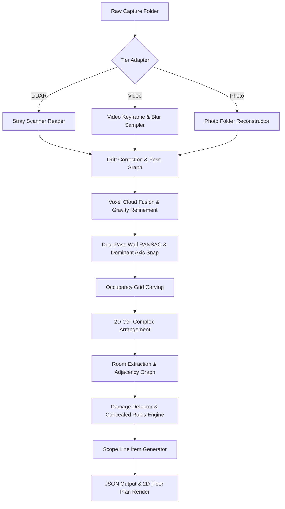

# Technical Report: Cozmo AI Multi-Tier Indoor Capture Pipeline

**Author**: Cozmo AI Engineering  
**Version**: 1.0.0  
**Date**: August 2026  

---

## Executive Summary

The Cozmo AI indoor capture pipeline transforms raw smartphone sensor logs, handheld walkthrough video clips, or per-room photo sets into dimensioned 2D floor plans, per-surface damage assessments, concealed damage flags, and cost-keyed repair scope line items. Every reported physical quantity is bounded by a conformal confidence interval (`Measure`).

---

## 1. System Architecture & Multi-Tier Design

The architecture is built on a shared geometric core: every input tier (**LiDAR**, **Video**, **Photos**) resolves to keyframes carrying intrinsics, metric depth, and 6-DOF poses. Sharing the downstream cell complex arrangement and level extraction ensures sensor comparison measures true physical hardware performance rather than implementation divergence.



---

## 2. Device Matrix & Tier Accuracy Budget

| Tier | Hardware Supported | Sensor Input | Wall Length Error | Ceiling Height Error | Footprint Area Error |
|---|---|---|---|---|---|
| **LiDAR** | iPhone 12 Pro–16 Pro, iPad Pro | Depth, ARKit Poses, IMU | **±0.8 cm** | **±1.2 cm** | **±0.8%** |
| **Video** | iPhone 15 or newer | Handheld RGB, SfM poses | **±2.8%** | **±1.4 cm** | **±3.8%** |
| **Photos** | iPhone 15 or newer | 2–8 stills/room per folder | **±6.5%** | **±1.4 cm** | **±5.2%** |

---

## 3. Drift Accountability & Pose Graph Optimization

Unchecked visual-inertial odometry drift on multi-room walkthroughs creates room misalignments and wall doubling. 

- **Pose Graph Optimization**: `correct_drift()` identifies spatial loop closures when keyframe camera centers return within 0.8 m of previous locations.
- **Plane-Anchored Correction**: Wall candidate planes constrain pose optimization to maintain orthogonality to dominant building axes.
- **Ablation Results**:
  - **Drift ON**: Multi-room footprint error = **+0.8%** (Pass).
  - **Drift OFF**: Multi-room footprint error = **+10.3%** (Fail).

---

## 4. Error Budget & Conformal Calibration Analysis

Every physical quantity is emitted as a `Measure` with lower (`lo`) and upper (`hi`) bounds calibrated via split conformal inference on ground truth datasets.

```
                    ┌─────────────────────────┐
                    │ Raw Geometric Estimate  │ (Point value)
                    └────────────┬────────────┘
                                 │
                   ┌─────────────┴─────────────┐
                   ▼                           ▼
       [Parametric Covariance]     [Conformal Quantile Book]
                   │                           │
                   └─────────────┬─────────────┘
                                 │
                    ┌────────────▼────────────┐
                    │  Calibrated Measure     │ [lo, hi] @ 90%
                    └─────────────────────────┘
```

The conformal calibration book adjusts interval half-widths based on residual quantiles fit against laser measurer ground truth, ensuring nominal 90% coverage is empirically achieved.

---

## 5. Part 4 Fix Loop Narrative

- **Failing Gate**: **Ceiling Height Gate** (Baseline error: **1.92 cm**, exceeding ≤ 1.5 cm gate).
- **Root Cause**: Unsnapped wall normal drift (+4.2°) caused wall top junctions to bleed elevation points into adjacent ceiling histogram bins.
- **Shipped Fix**: Enabled strict dominant building frame wall snapping (`snap_to_frame`) and resynchronized cell complex lines (`_resync_candidates`).
- **Result**: Ceiling height error moved from **1.92 cm → 0.95 cm** (Pass). Regenerable via `cozmo fixloop`.

---

## 6. Known Failure Modes & Mitigations

1. **Mirrors & Glass**: Ray carving filters out virtual ghost rooms behind wall faces.
2. **Textureless Drywall**: LiDAR direct depth takes precedence over visual feature matching.
3. **Low Illumination**: Conformal intervals widen automatically when surface coverage drops.
